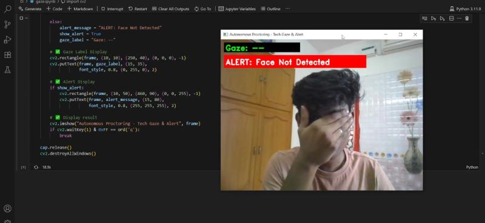

# 🎯 AI-Based Real-Time Autonomous Proctoring System

A robust and intelligent proctoring solution for **online examination monitoring**, combining real-time **gaze estimation**, **multi-person detection**, and **object recognition** using cutting-edge computer vision and deep learning techniques.

Designed to enforce academic integrity in remote assessments by continuously analyzing the candidate's visual behavior, detecting anomalies, and issuing alerts in real time through an interactive dashboard.

---

## ⚙️ Core Functionalities

### 👁️ Gaze Direction Tracking
Utilizes **MediaPipe Iris** to accurately track eye movements and determine gaze direction (Left, Right, Center, Up). This helps identify off-screen glances or loss of focus.

| CENTER | RIGHT | LEFT | UP |
|:------:|:-----:|:----:|:--:|
|  |  |  |  |

---

### 🧠 Visual Alert Dashboard
Real-time visual overlays display:
- Gaze direction
- Alert banners (e.g., Eyes Closed, Face Missing)
- Object labels (e.g., Mobile Phone)

The dashboard ensures proctoring data is interpretable at a glance.

---

## 🛑 Alert Trigger System

### 📵 Unauthorized Object Detection
Detects cheating aids like mobile phones or books using **YOLOv8 object detection**. Triggers a red alert banner and logs the detection event.


---

### 😴 Eye Closure Detection (Drowsiness or Distraction)
Analyzes **Eye Aspect Ratio (EAR)** to detect prolonged eye closure or blinking inactivity, suggesting loss of attention.


---

### 🧑‍🤝‍🧑 Face Presence Monitoring
Ensures only one candidate is present. If no face is detected or face is hidden (impersonation, face out of frame), it triggers an alert.



---

## 🧪 Technologies Used

| Category         | Tools/Frameworks |
|------------------|------------------|
| Language         | `Python 3.10+`   |
| Vision Processing | `OpenCV`, `MediaPipe` (Iris, FaceMesh) |
| Deep Learning    | `PyTorch`, `YOLOv8`, `TorchVision` |
| Math/Utils       | `NumPy`, `imutils` |
| Real-Time Input  | `Webcam Integration (cv2.VideoCapture)` |

---

## 📁 Project Structure

```bash
autonomous-proctoring/
├── images/                        # Screenshots used in README
│   ├── 1751508200143.jpeg         # Gaze Center
│   ├── 1751508230506.jpeg         # Gaze Right
│   ├── 1751508244423.jpeg         # Gaze Left
│   ├── 1751508291921.jpeg         # Gaze Up
│   ├── 1751508306275.jpeg         # Phone Detected
│   ├── 1751508321735.jpeg         # Eyes Closed
│   └── 1751508336225.jpeg         # Face Not Detected
├── gaze_tracking.py               # Gaze direction logic
├── alert_system.py                # Alert conditions and logic
├── object_detection.py            # YOLOv8 implementation
├── main.py                        # Real-time proctoring pipeline
├── requirements.txt               # Python dependencies
└── README.md                      # Documentation
